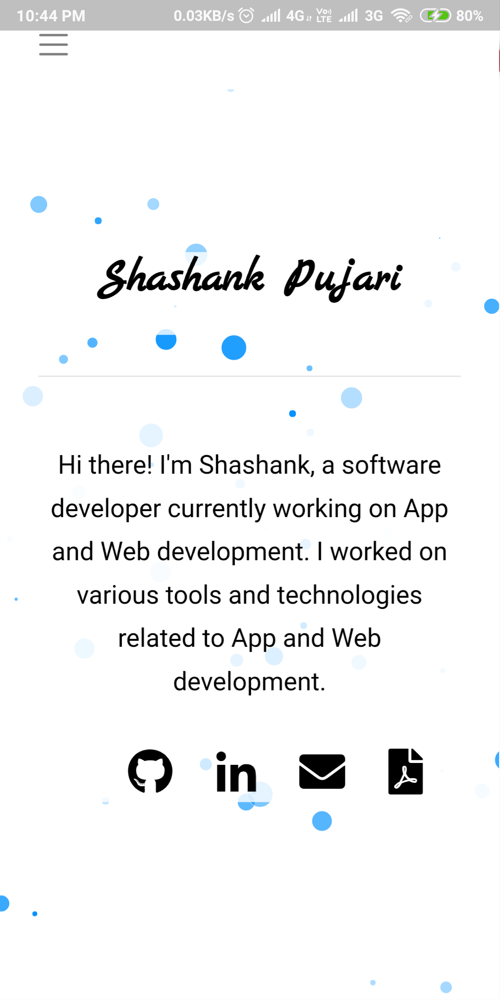

# Flutter Webview App

Flutter Webview App

It is a Webview App Completely made using Flutter and Dart. Based on URL provided to this it creates App for that website. This App can be deployed on both iOS and Android Devices.

using below command from your project folder you can create build app/apk

    flutter build apk

Technologies used: Android Studio, Flutter Framework, Dart Language

IDE: Android Studio 3.2.1

### ScreenShots

## Getting Started

For help getting started with Flutter, view official online
[documentation](https://flutter.io/).
